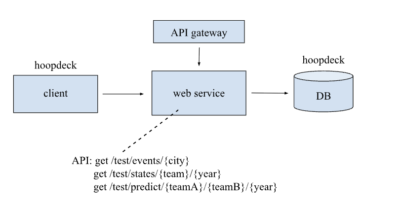
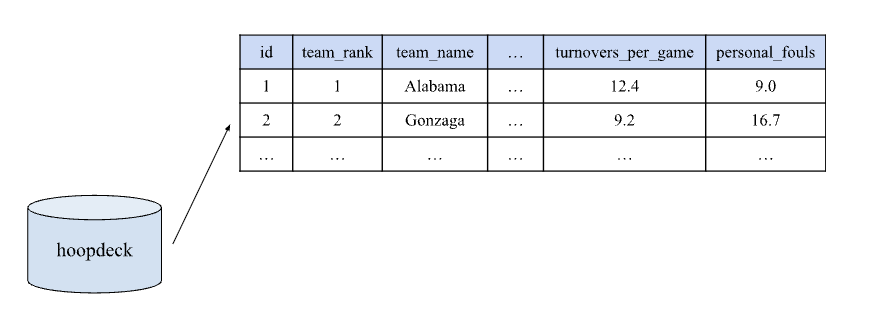
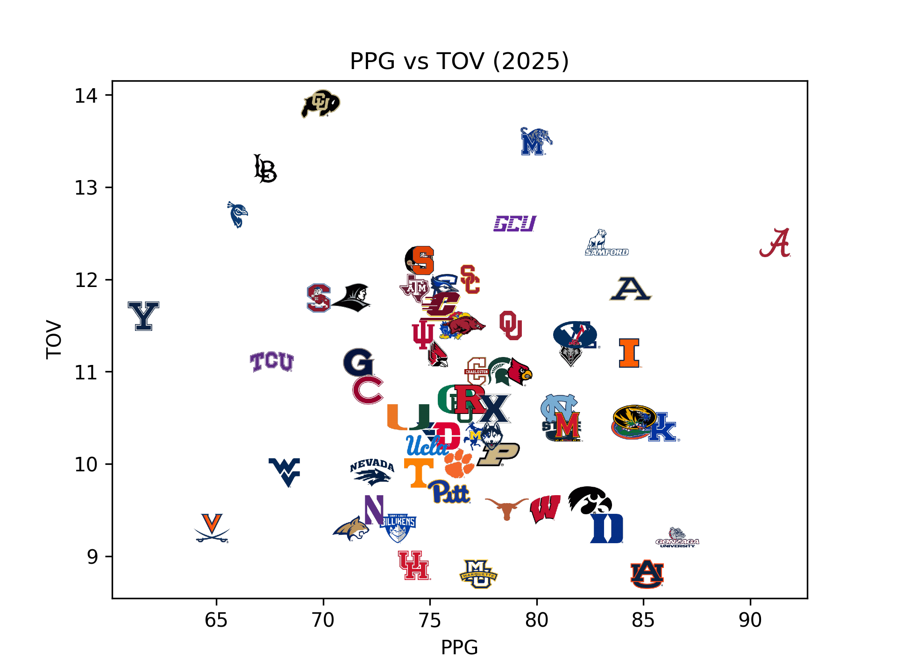

# HoopDeck AWS Project

HoopDeck is a basketball analytics platform concept designed to provide fans with advanced insights into team and player performance.  
This project demonstrates my use of **AWS cloud services** to build a serverless architecture, including **AWS Lambda**, **API Gateway**, **S3**, **RDS (MySQL)**, and **SageMaker** for AI-driven analysis.  

I had to pause my AWS account due to SageMaker charges and running through the free tier, so the system is not currently operational.  
However, the repository includes the architecture, data flow, and code for each AWS Lambda function, as well as the client configuration.

---

## 📄 Project Overview

The goal of HoopDeck was to:

- Scrape NCAA basketball team season stats.
- Store stats in an AWS RDS MySQL database.
- Provide API endpoints for:
  - `/stats/{team}` – Returns a team’s seasonal statistics.
  - `/graph/{stat1}/{stat2}` – Predicts the game outcome between two teams for a given season using SageMaker models.
  - `/predict/{teamA}/{teamB}/year` - Retrieves available games in a given city using the **Ticketmaster API**.
- Use AWS SageMaker for AI-powered predictions and analytics.
- Host frontend via a Dockerized client.

---

## 📊 System Diagrams

**Project Structure**  
[](docs/HoopDeck_Structure.png)

**API Gateway Endpoints**  
[](docs/HoopDeck_API_Gateway.png)

**Database Schema**  
[](docs/HoopDeck_Database_Schema.png)

---

## 📈 Example Output

Example of a **Points Per Game vs Turnovers** chart generated from stored team data:  
[](docs/2025_PPG_TOV_graph.png)

---

## 🛠️ Tools & Technologies

- **AWS Lambda** – Serverless compute for backend logic
- **AWS API Gateway** – REST API endpoints
- **AWS RDS (MySQL)** – Relational database for team stats
- **AWS S3** – Static file storage (charts, assets)
- **AWS SageMaker** – Machine learning predictions
- **Python** – Scraping, data processing, Lambda functions
- **Docker** – Containerized client environment

---

## 📂 Repository Structure

```plaintext
├── client/                   # Frontend client code & setup scripts
│   ├── main.py
│   ├── hoopdeck-client-config.ini
│   ├── _setup-linux.bash
│   ├── _setup-mac.bash
│   ├── _setup-windows.ps1
│   ├── docker/               # Docker build/run scripts
│   └── 2025_PPG_TOV_graph.png # Example chart output

├── lambdas/                  # AWS Lambda functions
│   ├── hoopdeck-predict/     # `/predict/{teamA}/{teamB}/{year}` – Game outcome predictions via SageMaker
│   ├── hoopdeck-scraper/     # EventBridge-triggered scraper for NCAA team stats
│   ├── hoopdeck-stats/       # `/stats/{team}` – Returns a team’s seasonal statistics
│   └── hoopdeck-ticketmaster/# `/events/{city}` – Uses Ticketmaster API to find games/events in a given city

├── docs/                     # Project documentation & diagrams
│   ├── HoopDeck_Description.pdf
│   ├── HoopDeck_Structure.png
│   ├── HoopDeck_API_Gateway.png
│   ├── HoopDeck_Database_Schema.png
│   └── 2025_PPG_TOV_graph.png

└── hoopdeck-sql.sql          # MySQL schema for AWS RDS

```

---

## 📄 Documentation

For more details on the system architecture, workflow, and AWS services used, see the  
[**HoopDeck Project Description (PDF)**](docs/HoopDeck_Description.pdf).

---
